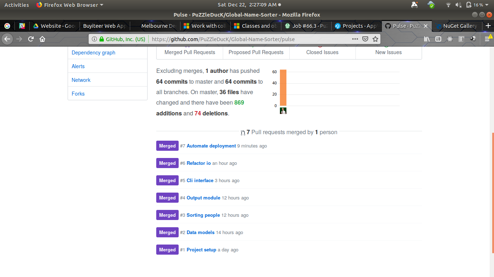
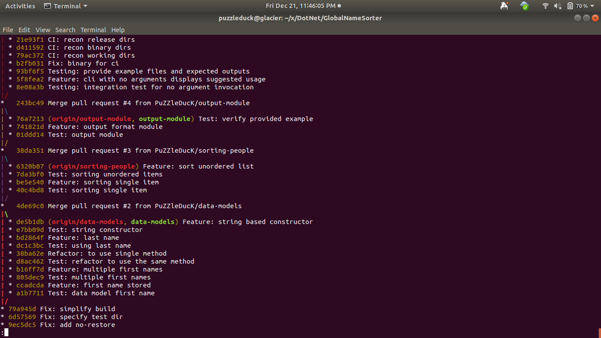
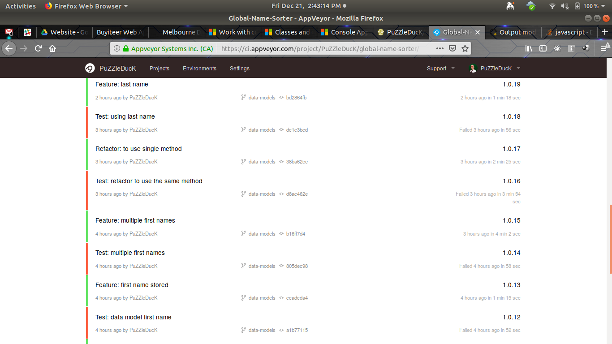
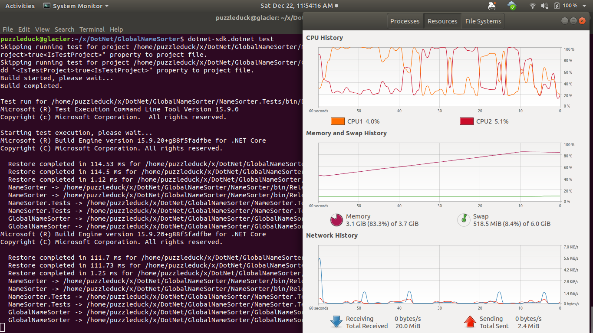
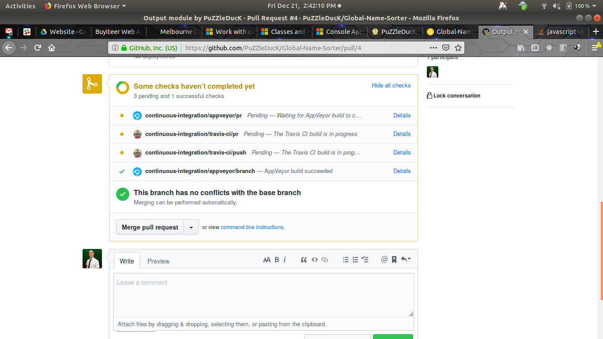
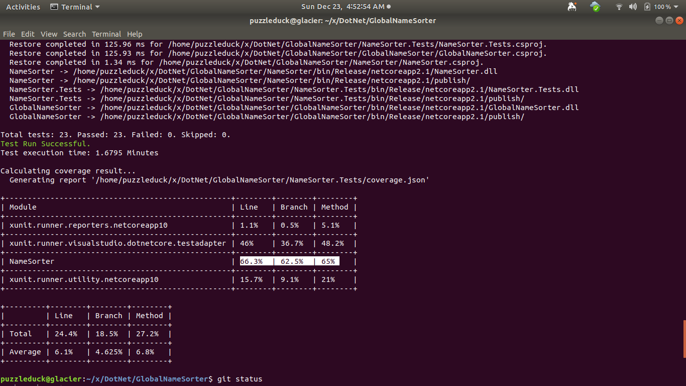
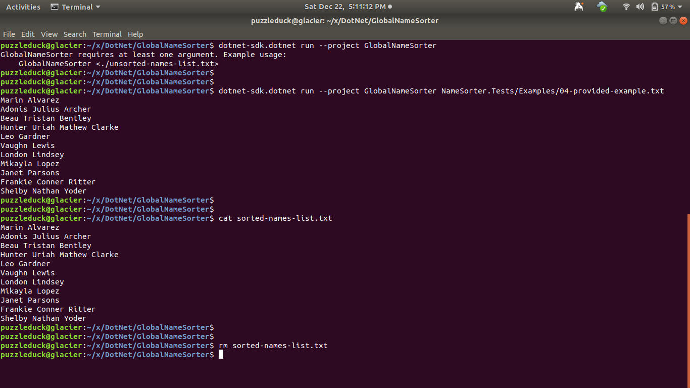
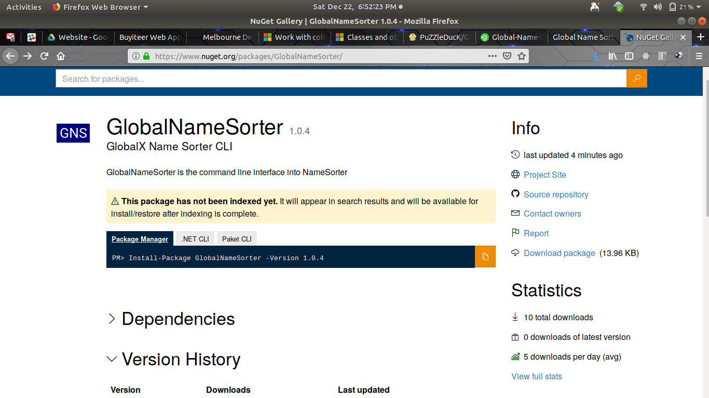
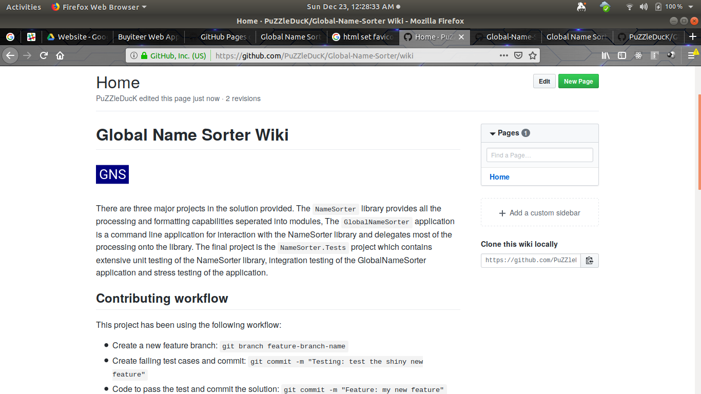

# Global X - Global Name Sorter


#### Build histories


## Project Structure

There are three major projects in the solution provided. The `NameSorter` library provides all the processing and formatting capabilities seperated into modules, The `GlobalNameSorter` application is a command line application for interaction with the NameSorter library and delegates most of the processing onto the library. The final project is the `NameSorter.Tests` project which contains extensive unit testing of the NameSorter library, integration testing of the GlobalNameSorter application and stress testing of the application. In the long run it could be beneficial to separate the tests into different packages to improve build times and allow developers to run the quicker unit tests during development and allow the CI pipelines to run the stress and integration tests.

The `NameSorter` library itself is also very modular with namespaces and interfaces that seperate the responsibilities of input, output, formatting, sorting and the data models. This leaves the NameSorter.cs primarily as a delegator and coordinator to the provided modules.

The source code and further documentation for this project is available at [GitHub](https://github.com/PuZZleDucK/Global-Name-Sorter). NuGet packaged versions of the [GlobalNameSorter](https://www.nuget.org/packages/GlobalNameSorter) and [NameSorter](https://www.nuget.org/packages/NameSorter) are available on NuGet or through the dotnet tooling.

During development I have adopted a GitFlow like workflow and have created feature branches for most features and additions as pictured below. Each branch also ran through continuous integration testing before being merged back into the master branch.

Feature Branching          | GitFlow Workflow
:-------------------------:|:---------------------:
   | 

The project has continuous integration setups on [Travis](https://travis-ci.org/PuZZleDucK/Global-Name-Sorter) and [AppVeyor](https://ci.appveyor.com/project/PuZZleDucK/global-name-sorter) and the Travis setup also runs a deployment phase on changes to the master branch. This deployment phase will trigger a production build and then push the generated packages to NuGet.

During development of the library I utilised TDD to drive the implementation as shown in the red-green pattern on the CI builds during development shown below. During development of the command line interface I switched to using integration tests although some of these could have been re factored into unit tests also.

I have stress tested the application with up to 1 million random names, however my hardware couldn't push the tests much further than this and the final tests pushed to master were scaled back to keep reasonable run times. Performance was acceptable for the expected workloads however possible improvements could be made by processing the file in chunks rather than all at once if any use cases demanded that kind of performance. The more exotic tests uncovered some obscure issues with some unicode characters and single character names, however the possibility of these defects impacting usual operation was assumed to be minor.

All tests suites were run sequentially in CI and some improvements could be made by separating the suites and running them in parallel, however build and test times were adequate for my purposes. I have also just started checking the project for test coverage which looks to be at about 60% and I would aim to improve the coverage if development were to continue.

Test Driven Development    | Stress Testing         
:-------------------------:|:----------------------:
  | 

Automated Testing          | Test Coverage           
:-------------------------:|:----------------------:
   |   

The project tries to communicate clearly with users and developers from end to end, starting with a complete web presence including [a wiki](https://github.com/PuZZleDucK/Global-Name-Sorter/wiki), simple [promotional website](https://puzzleduck.github.io/Global-Name-Sorter/) and published [NuGet packages](https://www.nuget.org/profiles/PuZZleDucK) as pictured below. This level of documentation introduces potential uses and developers to the library and application.

The application user interface is another place where we communicate with users early in the process. The UI includes usage information to guide the user into correct usage as pictured below. I have also tried to structure the project in a simple and comprehensible way and followed dotnet conventions on structure and naming. The code itself also attempts to be relatively self contained where possible and have included comments to guide the first time reader. The project also uses expressive naming to improve readability of the code.

Pages:

Program Usage            | NuGet Package          | GitHub Wiki
:-----------------------:|:----------------------:|:---------------------:
    |   | 


## Running the project

To get started, clone the project and change into the directory
```
git clone
cd
```

To build a developmet version simply run:
```
dotnet build
```

Then to run the command line interface demo run:
```
dotnet run --project GlobalNameSorter
dotnet run --project GlobalNameSorter NameSorter.Tests/Examples/04-provided-example.txt
```

To run the project tests:
```
dotnet test
```

you can also checkout the [Contributing Guide](CONTRIBUTING.md) or [wiki](https://github.com/PuZZleDucK/Global-Name-Sorter/wiki) to find out more about getting involved with Global Name Sorter.


## Assumptions and Issues

- Difficult to judge expected usage or corner cases without more context
- Clarifications on sort rules for unusual cases would be useful
- Could a name not have a last-name and only have a first-name? My assumption was yes
- A no-last-name assumption causes possible issues with where to sort a name with no last-name
- The problem description describes invoking the program like so: ```name-sorter ./unsorted-names-list.txt```. However dotnet core seems to (by design) not produce standalone executables in the interests of platform independence. I have included instructions on how to run the program as best I can.


## Plan

- [x] review challenge
- [x] plan approach
- [x] review GlobalX github repos for style/practices/project layout/etc
- [x] docs & github setup
- [x] setup wiki
- [x] GH Pages
- [x] Issue templates
- [x] Pull request template
- [x] initialise project
- [x] setup tests
- [x] semantic versioning
- [x] setup CI
- [x] setup nuget deployment
- [x] data models
- [x] sort library
- [x] output formatter
- [x] integration tests
- [x] cli program with no input
- [x] example inputs
- [x] program with simple inputs
- [x] file output
- [x] extract i/o modules
- [x] automate deployment
- [x] stress testing?
- [x] advanced inputs
- [x] SOLID review
- [x] naming review
- [x] review c# conventions
- [x] update packaging, 64x64 icon
- [x] update docs and instructions
- [x] update wiki, contrib and GH pages
- [x] readability review
- [x] comment review
- [ ] final review


## Source Code Review

Observations from reviewing GlobalX public repositories on GitHub. They are presented in approximate order I expect to emulate the good examples:

- [x] top level Project & Project.Tests convention
- [x] include guides (user/dev) - readme.md/contributing.md
- [x] wiki
- [x] mit licence
- [x] CONTRIBUTING.md
- [x] include examples
- [x] include demo
- [x] include samples
- [x] newbe/hackathon/low-hanging-fruit planning (multiple file arguments, output file specification, large files, ...)
- [x] unit test project
- [x] integration test project
- [x] stress test project
- [x] long and descriptive naming
- [ ] self documenting... comments usually explain "why" or "why not the usual/expected way"
- [x] model / view separation
- [x] validation and verbose error reporting - n/a
- [x] honest about defects


## Problem Specification


GlobalX Coding Assessment
- [x] how your code communicates it's purpose clearly and with empathy
- [x] caring about how easy your code is to understand and navigate
- [x] your ability to compose quality code that adheres to SOLID principles
- [x] how you write tests.
- [x] best effort
- [X] a solution that you are proud of.
- [x] Build a name sorter
- [x] Given a set of names, order that set first by last name, then by any given names
- [x] A name must have at least 1 given name and may have up to 3 given names.
- [x] Given a a file called unsorted-names-list.txt containing the following list of names;
- [x] Executing the program in the following way; name-sorter ./unsorted-names-list.txt
- [x] Should result the sorted names to screen;
- [x] and a file in the working directory called sorted-names-list.txt containing the sorted names.
- [x] a list with a thousand names.
- [x] available for review on github.
- [x] names should be sorted correctly.
- [x] It should print the sorted list of names to screen.
- [x] It should write/overwrite the sorted list of names to a file called sorted-names-list.txt.
- [x] Unit tests
- [x] practical documentation
- [x] Create a build pipeline like Travis or AppVeyor that execute build and test
- [x] let us know the url of the repo
